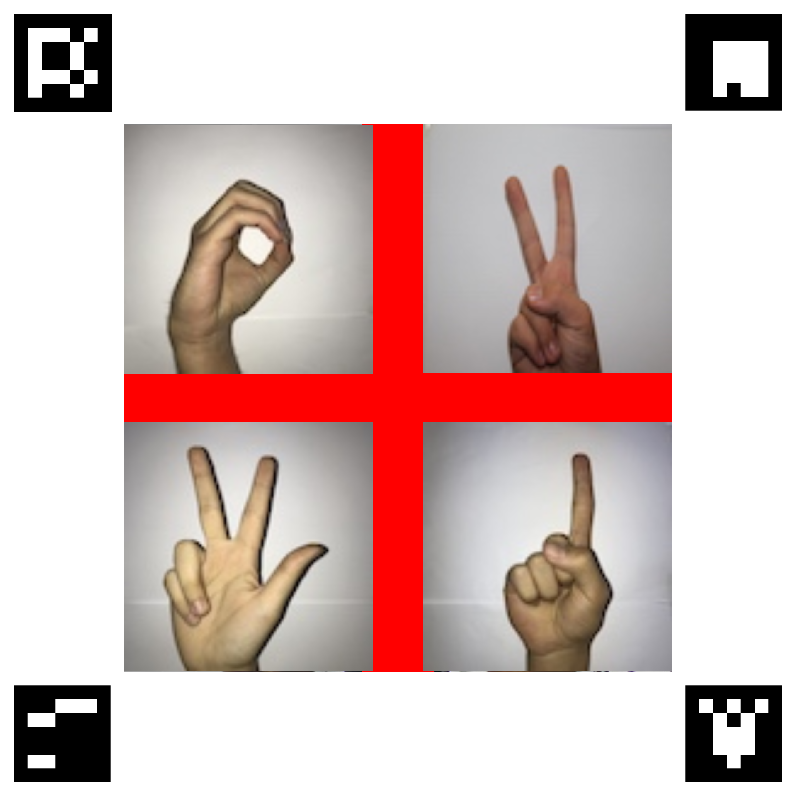

# MMT Interview Take-home question
Welcome to the MMT interview question! The following is the problem statement and assumptions you have to keep in mind in order to successfully attempt said question:

## Problem Statment
Assume the following, you have a robot placed on a 1.5 m by 1.5 m platform with the following design:



In this image:
 - The colored image in the center is 1m by 1m.
 - The robot is placed in the center of the red cross.
 - There are four images on each quadrant displaying hand gestures indicating numerical values (0, 1, 2, 3)

In this environment, there is a camera placed at 3 m elevation from the center of the red cross, facing downwards.

Your task is to:
  - Design a machine learning algorithm that classifies (based on a supplied dataset in ```/hand_gestures_dataset/```) the images of the gestures from the camera feed.
  - Spawn a 6-DOF robot on the center of the red cross (the choice of robot is left up to you!)
    - You have the freedom to obtain a pre-written urdf of a commercially available robot. Please indicate the source if you do so.
https://github.com/ros-industrial/universal_robot/tree/kinetic-devel/ur_description/urdf
    - Write/Copy in the description of the robot into ```/urdf/workspace.urdf.xacro```
    - You can launch the Gazebo world with the model and camera (which is pre-set for you!) with
```roslaunch robot_environment launch_world.launch```
  - Implement a control pipeline to control the robot using external commands. You can use any strategy (MoveIt!, custom controllers, etc.)
  - Write an algorithm that takes in the camera feed from the simulated environment (check Notes to know how to access camera feed), and labels the hand gestures on the base using the previously designed ML model, and saves this output as a .png file.
  - Design a program that takes in user input (in the form of an int from 0 to 3) and then moves the simulated robot such that it points in the direction of the hand gesture on the base.
##

## Notes:
### camera topic to be used is: 
```
/distorted_camera/link/camera/image
```

Also, assume that the camera matrix is as follows:


$$
    \begin{bmatrix}
    1171.5121418959693 & 0.0 & 640.5 \\
    0.0 & 1171.5121418959693 & 360.5 \\
    0.0 & 0.0 & 1.0
    \end{bmatrix}
$$

More camera details are available to you if you run the following:
```bash
rostopic echo /distorted_camera/link/camera/camera_info
```

### The following is a helper function in python for initializing the custom Aruco marker dict:
```python
def initialise_aruco_dictionary():
    global aruco_dict

    aruco_dict = aruco.custom_dictionary(4, 5)
    aruco_dict.markerSize = 5
    aruco_dict.maxCorrectionBits = 3
    aruco_dict.bytesList = np.empty(shape=(4, 4, 4), dtype=np.uint8)

    mybits = np.array([[0, 0, 0, 0, 0],
                       [0, 1, 1, 1, 1],
                       [0, 1, 1, 1, 1],
                       [0, 1, 1, 1, 1],
                       [0, 1, 0, 1, 1]],
                      dtype=np.uint8)
    aruco_dict.bytesList[0] = aruco.Dictionary_getByteListFromBits(mybits)

    mybits = np.array([[0, 0, 1, 1, 1],
                       [1, 1, 0, 0, 0],
                       [0, 0, 0, 0, 0],
                       [0, 0, 0, 0, 0],
                       [1, 1, 0, 0, 0]],
                      dtype=np.uint8)
    aruco_dict.bytesList[1] = aruco.Dictionary_getByteListFromBits(mybits)

    mybits = np.array([[1, 0, 1, 0, 1],
                       [0, 1, 0, 1, 0],
                       [0, 1, 1, 1, 0],
                       [0, 1, 1, 1, 0],
                       [0, 0, 1, 0, 0]],
                      dtype=np.uint8)
    aruco_dict.bytesList[2] = aruco.Dictionary_getByteListFromBits(mybits)

    mybits = np.array([[1, 0, 0, 1, 0],
                       [0, 1, 1, 0, 1],
                       [1, 0, 0, 1, 0],
                       [1, 0, 0, 1, 0],
                       [1, 1, 1, 1, 1]],
                      dtype=np.uint8)


    aruco_dict.bytesList[3] = aruco.Dictionary_getByteListFromBits(mybits)
```
